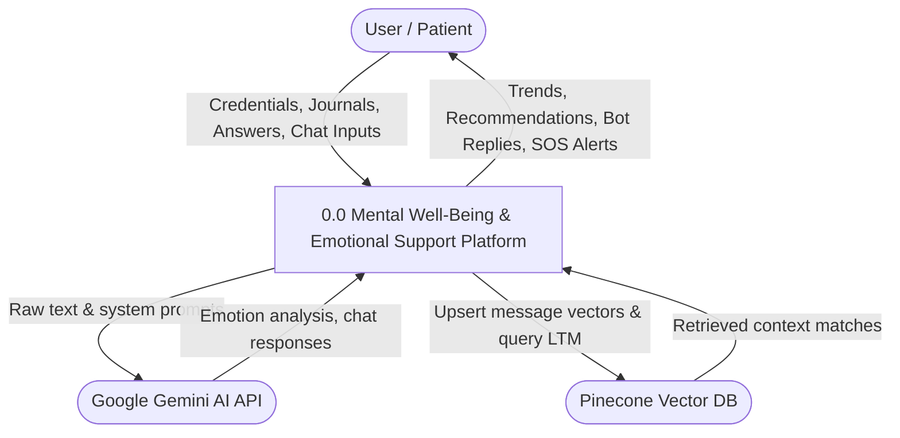
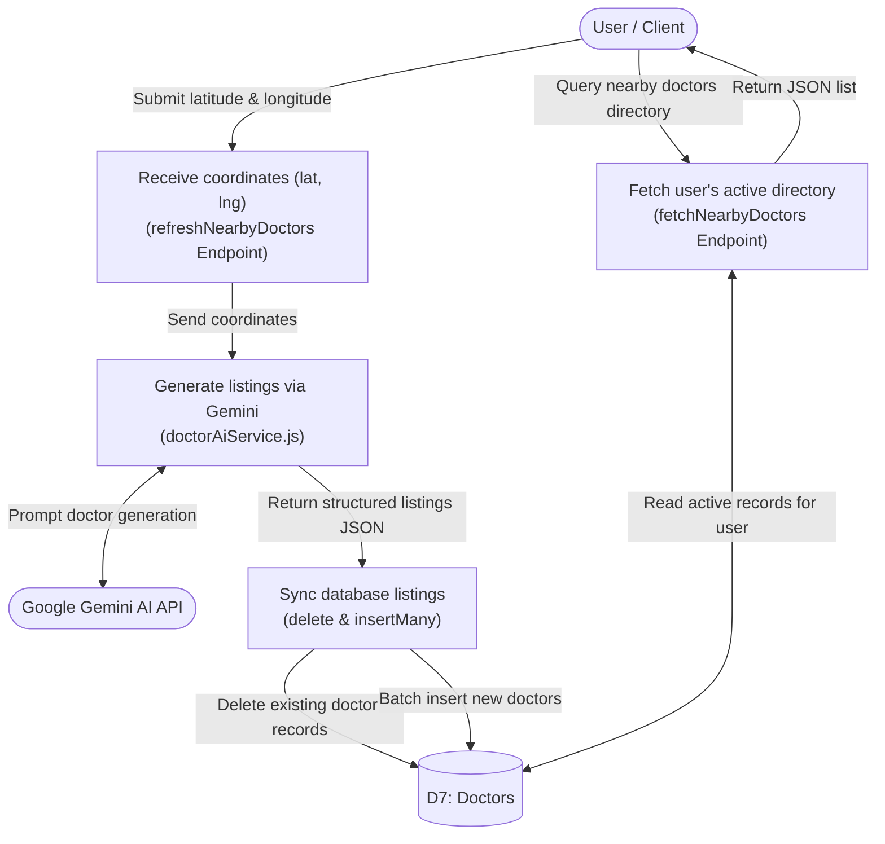

# Data Flow Diagrams (DFDs) for Project Report

This document contains **clean, highly readable, and 100% accurate Data Flow Diagrams (DFDs)** that match the exact database, Socket.IO, Pinecone, and Gemini AI implementations in the codebase. 

To help you generate visual diagrams using any AI model (like Gemini, ChatGPT, or Claude), each diagram includes its **Mermaid.js code** and a **plain-text prompt** that you can copy and paste directly into the LLM.

---

## 1. DFD Level 0 — Context Diagram

The Context Diagram shows the system boundary. The client application communicates with the user and relies on external AI nodes (**Google Gemini API** for NLP analysis/chat and **Pinecone Vector Database** for long-term memory).

### LLM Prompt to Generate DFD Level 0:
> "Generate a DFD Level 0 Context Diagram in Mermaid syntax for a Mental Health Platform. The external entities are the 'User / Patient', 'Google Gemini AI API', and 'Pinecone Vector DB'. The central process is '0.0 Mental Well-Being Platform'. Show the data flows: User sends auth credentials, journal text, test answers, and chat inputs. System returns mood trends, recommendations, chat replies, and crisis alerts. System requests vectors and LTM query matches from Pinecone, and sends text queries for sentiment analysis and chat prompts to Google Gemini."

### Mermaid Code:


---

## 2. DFD Level 1 — System DFD (Processes & Stores)

The Level 1 DFD decomposes the system into 6 core processes and maps exactly to the MongoDB schemas and Pinecone vector namespaces.

### LLM Prompt to Generate DFD Level 1:
> "Create a Level 1 DFD in Mermaid syntax for a mental well-being platform. 
> Define 6 processes: '1.0 Auth & Profile Management', '2.0 Journaling & NLP Pipeline', '3.0 Psychometric Assessment', '4.0 Socket.IO AI Chatbot', '5.0 Recommendation Engine', '6.0 Doctor Generator'.
> Define 7 MongoDB Data Stores: 'D1: Users', 'D2: Journals', 'D3: Assessment Results', 'D4: Chat Logs', 'D5: Crisis Events', 'D6: Resources', 'D7: Doctors'.
> Define 2 external entities: 'Google Gemini API' and 'Pinecone Vector DB'.
> Show data connections: 1.0 reads/writes D1. 2.0 reads/writes D2 (encrypted title/content), queries Gemini for NLP metrics, updates Pinecone vectors. 3.0 reads D3. 4.0 reads D4 (last 20 messages for short-term memory), queries Pinecone for long-term memory, generates chat replies via Gemini, logs crises in D5 if probability >= 0.70. 5.0 reads D3 (all tests) and queries D6 (Resources) using severity matching. 6.0 generates nearby listings via Gemini, deletes old entries, and saves to D7."

### Mermaid Code:
```mermaid
flowchart TD
    %% External Entities
    User([User / Patient])
    Gemini([Google Gemini AI API])
    Pinecone([Pinecone Vector DB])

    %% Processes
    P1["1.0 Auth & Profile Management"]
    P2["2.0 Journaling & NLP Pipeline"]
    P3["3.0 Psychometric Assessment"]
    P4["4.0 Socket.IO AI Chatbot"]
    P5["5.0 Recommendation Engine"]
    P6["6.0 Doctor Generator"]

    %% Data Stores
    D1[("D1: Users")]
    D2[("D2: Journals (AES-Encrypted)")]
    D3[("D3: Assessment Results")]
    D4[("D4: Chat Logs")]
    D5[("D5: Crisis Events")]
    D6[("D6: Resources")]
    D7[("D7: Doctors")]

    %% User Interactions
    User <-->|Credentials / Profile| P1
    User -->|Write Journal| P2
    User -->|Submit Test Answers| P3
    User <-->|Socket chat messages| P4
    User <--|View Recommendations| P5
    User <--|Search Doctors| P6

    %% Storage connections
    P1 <--> D1
    P2 -->|Save journal + NLP tags| D2
    P3 -->|Save scored result| D3
    P4 <-->|Save messages / Read STM history| D4
    P4 -->|Log high-risk indicators| D5
    P5 <--|Query matching resources| D6
    P6 <-->|Save generated listings| D7

    %% System Dependencies
    P2 <-->|Analyze Emotion & Crisis| Gemini
    P2 -->|Create Journal Embedding| Pinecone

    P4 <-->|Empathetic completion / NLP| Gemini
    P4 <-->|LTM upsert & retrieval| Pinecone

    P6 <-->|Generate listings by coordinates| Gemini
```

---

## 3. DFD Level 2 — Detailed Subsystem Diagrams

### A. Journaling & NLP Analysis Pipeline

This diagram shows how `journalController.js` processes an entry: extracting metrics via Gemini, creating a vector, storing the memory in Pinecone, encrypting title/content using AES-256-CBC, and routing high-risk entries via the `crisisInterceptor.js` middleware.

### LLM Prompt to Generate DFD Level 2A:
> "Generate a DFD Level 2 diagram in Mermaid syntax representing the Journaling and NLP Pipeline for a mental health platform. Do not use any numeric prefixes for the processes (omit all serial numbers).
> The diagram should include:
> - Processes: 
>   - 'Authenticate Request (auth.js)'
>   - 'Initialize Interceptor (crisisInterceptor.js)'
>   - 'Analyze Emotion & Crisis (nlpService.js)'
>   - 'Generate Vector & Index (vectorService.js)'
>   - 'Encrypt & Store Entry (Mongoose Hook & Journals DB)'
>   - 'Evaluate & Modify Response (res.json Override)'
> - External Entities: 'User / Client', 'Google Gemini AI API', 'Pinecone Vector DB'
> - MongoDB Data Stores: 'D1: Users', 'D2: Journals', 'D5: Crisis Events'
> 
> Flow Sequence:
> 1. User sends raw text & JWT token to auth middleware process.
> 2. Auth process reads D1 to verify the user and forwards the payload to interceptor process.
> 3. Interceptor process wraps the res.json function and hands execution to analysis process.
> 4. Analysis process requests text metrics from Google Gemini AI API and saves the results in res.locals.
> 5. Indexing process vectorizes the text via Gemini and upserts the vector to Pinecone (partitioned by user namespace).
> 6. Storage process executes the Mongoose pre-save hook to encrypt content via AES-256-CBC, storing it in D2.
> 7. The controller triggers the modified res.json function in response process.
> 8. Response process checks if crisis probability >= 0.70. If so, it logs the incident to D5, appends warning alerts to the payload, and returns the modified JSON to the User. Otherwise, it sends the standard response."

### Mermaid Code:
```mermaid
flowchart TD
    User([User / Client])
    Gemini([Google Gemini AI API])
    Pinecone([Pinecone Vector DB])

    %% Database Collections
    D1[("D1: Users")]
    D2[("D2: Journals")]
    D5[("D5: Crisis Events")]

    %% Processes
    P1["Authenticate Request<br>(auth.js Middleware)"]
    P2["Initialize Interceptor<br>(crisisInterceptor.js Middleware)"]
    P3["Analyze Emotion & Crisis Metrics<br>(nlpService.js via Gemini)"]
    P4["Generate Vector & Index Memory<br>(vectorService.js via Pinecone)"]
    P5["Encrypt & Store Entry<br>(Mongoose pre-save Hook & D2: Journals)"]
    P6["Evaluate & Modify Response<br>(res.json Override Hook)"]

    %% Data Flow Connections
    User -->|Submit raw journal & JWT| P1
    P1 <-->|Verify JWT| D1
    
    P1 -->|Forward payload| P2
    P2 -->|Hook res.json method| P3
    
    %% NLP API
    P3 <-->|Send text / Return analysis JSON| Gemini
    P3 -->|Store nlpResult in res.locals| P4
    
    %% Vector
    P4 <-->|Request vector embedding| Gemini
    P4 -->|Upsert vectors under userId namespace| Pinecone
    
    %% Encryption & MongoDB Journals
    P4 -->|Save journal entry request| P5
    P5 -->|Encrypt fields (AES-CBC) & write| D2
    
    %% Response Interceptor Execution
    P5 -->|Invoke res.json response| P6
    P6 -->|Check crisis probability| P6
    P6 -->|If crisisProbability >= 0.70, write log| D5
    P6 -->|Return final response payload<br>(Mutated JSON with SOS if high risk)| User
```

---

### B. Real-Time Socket.IO Chatbot & Dual-Memory Retrieval

This diagram models the real-time chat pipeline, showing how Socket.IO processes message events, coordinates short-term and long-term memory, invokes the AI response engine, and intercepts potential crises.

### LLM Prompt to Generate DFD Level 2B:
> "Generate a simplified DFD Level 2 diagram in Mermaid syntax representing the Real-Time Chatbot Pipeline. Do not use any numeric prefixes for the processes (omit all serial numbers).
> The diagram should include:
> - Processes:
>   - 'Socket Handler' (Manages authentication & user message events)
>   - 'Memory Retriever' (Pulls short-term logs from MongoDB & long-term vectors from Pinecone)
>   - 'Gemini Response & NLP Engine' (Requests chatbot responses and analyzes emotional/crisis metrics via Gemini API)
>   - 'Crisis & SOS Monitor' (Logs severe threats to MongoDB and fires crisis warnings to User)
>   - 'DB & Vector Indexer' (Saves the chat dialogue to MongoDB and indexes embeddings in Pinecone)
> - External Entities: 'User / Client', 'Google Gemini AI API', 'Pinecone Vector DB'
> - MongoDB Data Stores: 'D4: Chat Logs', 'D5: Crisis Events'
> 
> Flow Sequence:
> 1. User sends a message via Socket.IO to Socket Handler.
> 2. Socket Handler requests conversational context from Memory Retriever.
> 3. Memory Retriever retrieves short-term history (last 20 messages) from D4 and queries Pinecone for matching long-term memories.
> 4. Memory Retriever passes the combined memory context back to Socket Handler.
> 5. Socket Handler sends the context to Response Engine to generate the empathetic bot reply and extract NLP metrics via Google Gemini API.
> 6. Response Engine returns the reply text and NLP metadata to Socket Handler.
> 7. Socket Handler routes NLP metrics to Crisis Monitor. If crisis probability is >= 0.70, Crisis Monitor logs the event in D5 and emits a 'crisis-alert' socket event.
> 8. Socket Handler emits 'ai-response' with the chatbot's response text back to the User.
> 9. Socket Handler sends the dialogue exchange to Indexer to save the messages in D4 and index their vector embeddings in Pinecone."

### Mermaid Code:
```mermaid
flowchart TD
    User([User / Client])
    Gemini([Google Gemini AI API])
    Pinecone([Pinecone Vector DB])

    %% Data Stores
    D4[("D4: Chat Logs")]
    D5[("D5: Crisis Events")]

    %% Processes
    P1["Socket Handler"]
    P2["Memory Retriever"]
    P3["Gemini Response & NLP Engine"]
    P4["Crisis & SOS Monitor"]
    P5["DB & Vector Indexer"]

    %% Data Flow Connections
    User -->|Send Message| P1
    P1 -->|Request Context| P2
    P2 <-->|Fetch STM (last 20)| D4
    P2 <-->|Query LTM matches| Pinecone
    P2 -->|Memory context| P1
    
    P1 <-->|Generate response & NLP metrics| P3
    P3 <-->|Query AI models| Gemini
    
    P1 -->|Evaluate safety metrics| P4
    P4 -->|If crisisProbability >= 0.70, log alert| D5
    P4 -.->|Emit socket 'crisis-alert'| User

    P1 -->|Emit socket 'ai-response'| User
    
    P1 -->|Index dialogue history| P5
    P5 -->|Save User/Bot messages| D4
    P5 -->|Upsert User/Bot vectors| Pinecone
```

---

### C. Psychometric Assessment & Recommendation Engine

This diagram shows how `assessmentController.js` scores responses using modular functions in `scoring.js`, and how `recommendationService.js` reads these results, normalizes severities, scores resources based on tag overlap and severity bonuses, and applies the safety net.

### LLM Prompt to Generate DFD Level 2C:
> "Generate a DFD Level 2 diagram in Mermaid syntax representing the Assessment and Recommendation Pipeline. Do not use any numeric prefixes for the processes (omit all serial numbers).
> The diagram should include:
> - Processes:
>   - 'Calculate raw test score (scoring.js modules)'
>   - 'Save assessment results (AssessmentResult Model)'
>   - 'Query latest attempts per test type'
>   - 'Map & Normalize Severities (SEVERITY_MAP)'
>   - 'Score matching resource relevance'
>   - 'Apply severe safety net check'
>   - 'Group & category formatting'
> - External Entities: 'User / Client'
> - MongoDB Data Stores: 'D3: Assessment Results', 'D6: Resources'
> 
> Flow Sequence:
> 1. User submits test answers (GAD-7, PHQ-9, PSS, WHO-5, ISI) to scoring process.
> 2. Scoring process applies modular scoring calculations and sends final totalScore, interpretation string, and clinical feedback to results process.
> 3. Results process stores the results in D3.
> 4. User requests recommendations from attempts process.
> 5. Attempts process reads the latest result for EACH completed test from D3 and forwards them to mapping process.
> 6. Mapping process maps clinical terms (e.g., 'Moderately Severe') to normalized levels ('mild', 'moderate', or 'severe').
> 7. Mapping process sends normalized severity levels and test tags to relevance process.
> 8. Relevance process queries D6 for candidate resources and scores them (adds overlap count, plus a severity bonus of +3 for severe, +2 for moderate, +1 for mild).
> 9. Relevance process passes ranked recommendations to safety process.
> 10. Safety process verifies if any test scored 'severe': if so, it ensures at least one 'severe' resource is included, prepending it to the list.
> 11. Safety process forwards the safe list to formatting process.
> 12. Formatting process splits recommendations by type (videos, articles, activities, music) and returns JSON to User."

### Mermaid Code:
```mermaid
flowchart TD
    User([User / Client])

    %% Database Collections
    D3[("D3: Assessment Results")]
    D6[("D6: Resources")]

    %% Processes
    P1["Calculate raw test score<br>(scoring.js modules)"]
    P2["Save assessment results<br>(AssessmentResult Model)"]
    P3["Query latest attempts per test type"]
    P4["Map & Normalize Severities<br>(SEVERITY_MAP)"]
    P5["Score matching resource relevance<br>(Tag overlap & weight bonus)"]
    P6["Apply severe safety net check"]
    P7["Group & category formatting"]

    %% Data Flow Connections
    User -->|Submit test answers| P1
    P1 -->|Scored test metrics| P2
    P2 -->|Write attempt record| D3
    
    User -->|Request recommendations| P3
    P3 <-->|Find latest completed test documents| D3
    P3 -->|Completed test documents| P4
    P4 -->|Mapped severity levels & tags| P5
    
    P5 <-->|Query matching resources| D6
    P5 -->|Scored candidates list| P6
    P6 -->|Enforce severe resource check| P7
    P7 -->|Return categorized JSON<br>(Videos, Articles, Activities, Music)| User
```

---

## DFD Level 2D — AI-Powered Doctor Directory Generator

This diagram shows how `doctorController.js` and `doctorAiService.js` generate relevant, location-specific professional directory data on-the-fly.

### LLM Prompt to Generate DFD Level 2D:
> "Generate a DFD Level 2 diagram in Mermaid syntax representing the AI-Powered Doctor Directory Generator. Do not use any numeric prefixes for the processes (omit all serial numbers).
> The diagram should include:
> - Processes:
>   - 'Receive coordinates (lat, lng)'
>   - 'Generate listings via Gemini (doctorAiService.js)'
>   - 'Sync database listings (delete & insert)'
>   - 'Fetch user's active directory'
> - External Entities: 'User / Client', 'Google Gemini AI API'
> - MongoDB Data Stores: 'D7: Doctors'
> 
> Flow Sequence:
> 1. User submits GPS coordinates (latitude, longitude) to coordinates process.
> 2. Coordinates process sends the coordinates to generation process.
> 3. Generation process prompts Google Gemini AI API with coordinates to search and structure clinical doctor details (fees, qualifications, addresses, coordinates) in JSON format.
> 4. Generation process forwards structured JSON listing to sync process.
> 5. Sync process queries D7 to delete all old doctors previously generated for this user.
> 6. Sync process batch-inserts the new list into D7, associating the records with the user's ID.
> 7. User triggers nearby request to fetch process.
> 8. Fetch process reads D7 and returns the collection JSON of doctors back to the User."

### Mermaid Code:

